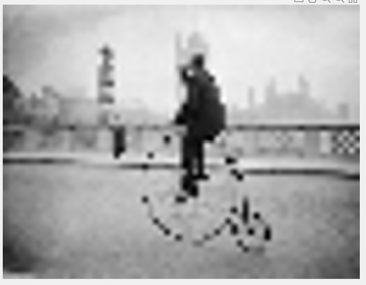

# Introduction
Implementation of basic algorithms of Computer Vision

# Down sample
## files
downsample_img.m
## Input

## Output

# Match correspondences
## files
Find_best_match_ssd.m
## Task
    Find patch in strip and return column index (x value) of topleft corner) using sum of square differences (SSD))
## Input
    Image pair from stereo camera
    
    

# Result

# References
- [Udacity-computer vision](https://classroom.udacity.com/courses/ud810)
